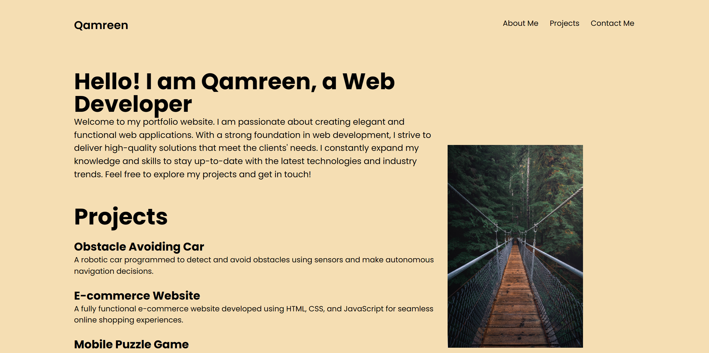

# My Portfolio

This is my personal portfolio website showcasing my skills and projects as a web developer.

## Table of Contents
- [About Me](#about-me)
- [Projects](#projects)
- [Contact Me](#contact-me)

## About Me
I am Qamreen, a passionate web developer with a strong foundation in web development. I strive to deliver high-quality and functional web applications. I am constantly expanding my knowledge and skills to stay up-to-date with the latest technologies and industry trends.

## Projects
- [Obstacle Avoiding Car](#obstacle-avoiding-car)
- [E-commerce Website](#e-commerce-website)
- [Mobile Puzzle Game](#mobile-puzzle-game)

### Obstacle Avoiding Car
A robotic car programmed to detect and avoid obstacles using sensors and make autonomous navigation decisions.

### E-commerce Website
A fully functional e-commerce website developed using HTML, CSS, and JavaScript for seamless online shopping experiences.

### Mobile Puzzle Game
An addictive puzzle game designed for mobile devices, featuring challenging levels and engaging gameplay mechanics.

## Contact Me
Feel free to reach out to me via the following platforms:
- LinkedIn: [View LinkedIn](https://www.linkedin.com)
- GitHub: [View GitHub](https://www.github.com)

